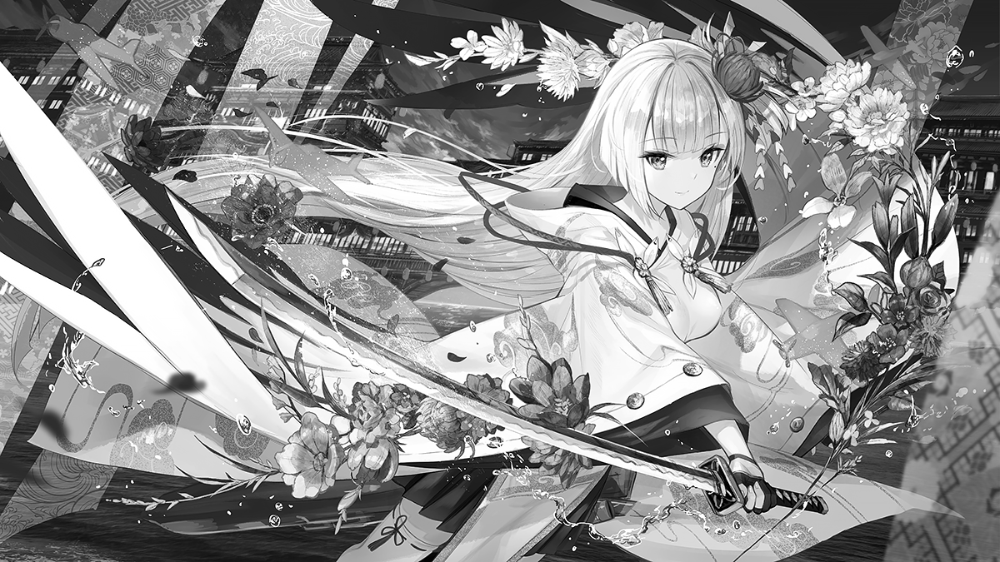
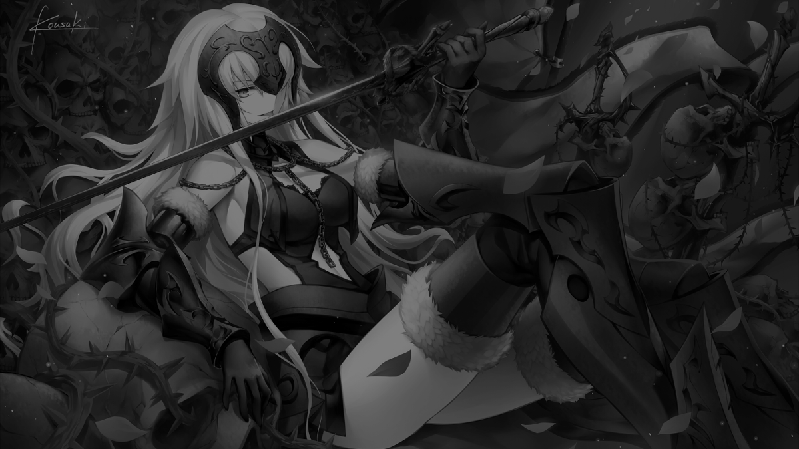
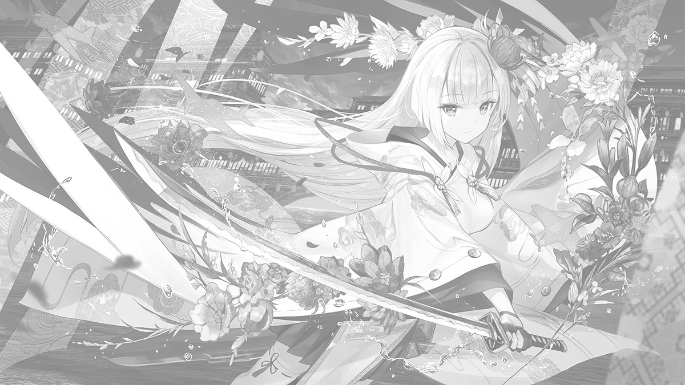
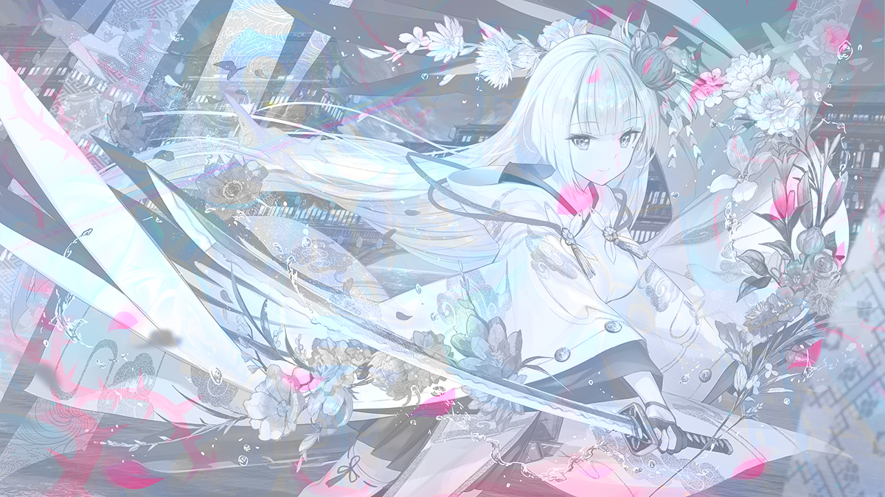

# 混合PNG生成

功能:

将两张图片合成为一张新的带有透明通道的新图片, 令新图片在指定的两种背景下的显示效果分别接近两张输入图片.

使用方式:
```bash
python main.py --image img1 img2 --output OUTPUT [--background black white] [--verbose] [--gray] [--reverse] [--adjust-ratio ADJUST_RATIO]
```

例如:
```bash
python main.py --image a.png b.png --output target --background black white
```
将会生成target.png, 在背景色为 black 时显示效果接近 a.png, 背景色为 white 时显示效果接近 b.png

对灰度图, 可以实现比较完美的显示效果.

对彩色图, 通常会导致第一张图片的显示效果较好, 第二张图片的显示效果较差.


## 灰度图示例

图1/图2





生成的图片在黑色/白色背景下的效果
(图片链接: [sample/gray.png](sample/gray.png))





## 彩色图示例

图1/图2


生成的图片在黑色/白色背景下的效果
(图片链接: [sample/colorful.png](sample/colorful.png))




